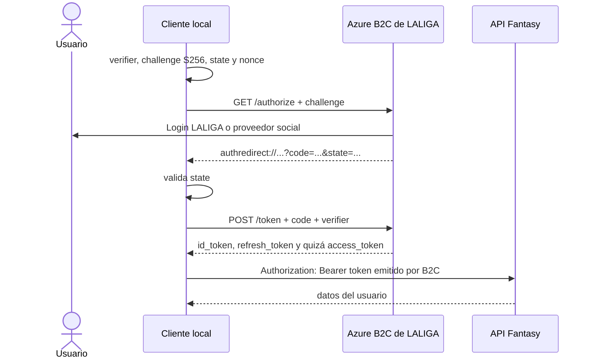

# API no oficial de LALIGA Fantasy

> Investigación comunitaria actualizada el **11 de septiembre de 2026**.

## Resumen ejecutivo

LALIGA Fantasy no publica una API para terceros ni un contrato OpenAPI. Existe un
servicio HTTP usado por sus clientes oficiales, pero es una **API privada y no
soportada**: puede cambiar sin aviso, no tiene SLA y su uso está sujeto a los
términos de LALIGA.

La temporada 2026/27 introdujo dos cambios importantes:

```text
Origen actual:  https://fantasy-api.llt-services.com
Base API:       https://fantasy-api.llt-services.com/api
Primera:        /v1/competition/1

Host antiguo:   https://api-fantasy.llt-services.com
```

El orden de `fantasy-api` es relevante. En agosto de 2026 el host antiguo
`api-fantasy` todavía respondía `200` con datos congelados de 2025/26 en algunas
rutas; el 11-09-2026 las dos rutas legacy comprobadas devolvieron `502`.

Este documento recoge **todos los endpoints encontrados en fuentes comunitarias
consultadas**, no todos los que puedan existir internamente. Los niveles usados
son:

- **Alta**: lectura comprobada sin credenciales el 11-09-2026 o coincidente en dos
  fuentes comunitarias recientes.
- **Media**: implementado por una fuente reciente o mutación coincidente en varias
  fuentes, pero no comprobado aquí contra una cuenta real.
- **Baja**: contrato contradictorio, incompleto o únicamente histórico.

## Convenciones

```text
ORIGIN = https://fantasy-api.llt-services.com
API    = {ORIGIN}/api
CMP    = {API}/v1/competition/1
```

Identificadores:

- `leagueId`: se obtiene de `GET {CMP}/leagues`.
- `teamId`: aparece en `league.team.id`, el standing o la lista de equipos.
- `playerId`: identificador maestro de un futbolista.
- `playerTeamId`: identificador de la ficha de ese futbolista dentro de una
  plantilla. No siempre es intercambiable con `playerId`.
- `marketId`, `bidId` y `offerId`: se obtienen de la respuesta de mercado/ofertas.
- `week`: número de jornada; `page` empieza normalmente en `0`.

Cabeceras observadas:

```http
Authorization: Bearer <access_token>
Accept: application/json
x-lang: es
x-app: Fantasy-web
```

`Authorization` solo es necesario en recursos privados. `x-lang` acepta otros
idiomas en algunos clientes; `x-app` se observa en la web oficial, pero no parece
imprescindible. Los cuerpos de escritura son JSON y deben usar
`Content-Type: application/json`.

## Catálogo comunitario actual

### Usuario y metadatos

| Método | Endpoint | Autenticación | Resultado | Confianza |
|---|---|---:|---|---|
| `GET` | `{API}/v4/user/me` | Sí | Perfil del mánager (`id`, `managerName`, etc.) | Alta |
| `GET` | `{API}/v5/activity-types` | No | Diccionario de los 33 tipos de actividad | Alta |
| `GET` | `{API}/v3/teams-master` | No | Equipos de las competiciones disponibles | Alta |
| `GET` | `{API}/v4/teams/lineup/formations?option=free` | No | Formaciones gratuitas | Alta |
| `GET` | `{API}/v4/teams/lineup/formations?option=premium` | No | Formaciones premium | Alta |
| `GET` | `{API}/v4/leagues/premium-configuration` | No | Opciones/configuración premium | Alta |

### Ligas, clasificación y plantillas

| Método | Endpoint | Resultado | Confianza |
|---|---|---|---|
| `GET` | `{CMP}/leagues` | Ligas del usuario y resumen de su equipo | Alta |
| `GET` | `{CMP}/leagues/{leagueId}/standing` | Clasificación general | Alta |
| `GET` | `{CMP}/leagues/{leagueId}/standing/{week}` | Clasificación de una jornada | Alta |
| `GET` | `{CMP}/leagues/{leagueId}/activity/{page}` | Actividad paginada de la liga | Alta |
| `GET` | `{CMP}/leagues/{leagueId}/teams` | Equipos/mánagers de la liga | Media |
| `GET` | `{CMP}/leagues/{leagueId}/teams/{teamId}` | Plantilla y cláusulas de un equipo | Alta |
| `GET` | `{CMP}/teams/{teamId}/money` | Caja e inversión del equipo propio | Alta |
| `GET` | `{CMP}/teams/{teamId}/lineup` | Alineación actual | Alta |
| `GET` | `{CMP}/teams/{teamId}/lineup/week/{week}` | Alineación de una jornada | Alta |
| `PUT` | `{CMP}/teams/{teamId}/lineup` | Sustituye la alineación | Media |

Todas estas rutas requieren bearer. El saldo de equipos rivales puede devolverse
vacío aunque se conozca su `teamId`.

Cuerpo observado para actualizar el once:

```json
{
  "goalkeeper": "player-team-id",
  "defender": ["id-1", "id-2", "id-3", "id-4"],
  "midfield": ["id-5", "id-6", "id-7", "id-8"],
  "striker": ["id-9", "id-10"],
  "tactical_formation": [4, 4, 2]
}
```

Debe contener once IDs únicos y una formación admitida. Las fuentes actuales
observan `3-4-3`, `3-5-2`, `4-3-3`, `4-4-2`, `4-5-1`, `5-3-2`, `5-4-1`,
`3-3-4`, `3-6-1`, `4-2-4`, `4-6-0` y `5-2-3`; su disponibilidad depende del
tipo de liga.

### Jugadores, jornada y calendario

| Método | Endpoint | Autenticación | Resultado | Confianza |
|---|---|---:|---|---|
| `GET` | `{CMP}/players` | No | Catálogo completo, estado, valor y puntos | Alta |
| `GET` | `{CMP}/player/{playerId}/market-value` | No | Histórico de valor de mercado | Alta |
| `GET` | `{CMP}/player/{playerId}/league/{leagueId}` | Sí | Ficha del jugador contextualizada a una liga | Alta |
| `GET` | `{CMP}/week/current` | No | Jornada actual y fechas de apertura/cierre | Alta |
| `GET` | `{CMP}/calendar?weekNumber={week}` | No | Partidos de una jornada | Alta |
| `GET` | `{ORIGIN}/stats/v1/competition/1/stats/week/{week}` | No | Estadísticas/resultados de la jornada | Alta |

El catálogo devolvió 840 entradas el día de la comprobación. El número cambia
durante la temporada y no debe utilizarse como validación permanente.

### Mercado y ofertas

Todas las rutas de esta sección requieren bearer.

| Método | Endpoint | Body | Resultado | Confianza |
|---|---|---|---|---|
| `GET` | `{CMP}/league/{leagueId}/market` | — | Mercado actual, pujas y ofertas del usuario | Alta |
| `GET` | `{CMP}/league/{leagueId}/market/history` | — | Histórico del mercado de la liga | Media |
| `GET` | `{CMP}/league/{leagueId}/playerTeam/{playerTeamId}/offer` | — | Ofertas sobre una ficha propia | Alta |
| `POST` | `{CMP}/league/{leagueId}/market/{marketId}/bid` | `{"money": 123456}` | Crea una puja | Media |
| `PUT` | `{CMP}/league/{leagueId}/market/{marketId}/bid/{bidId}` | `{"money": 123456}` | Modifica una puja | Media |
| `DELETE` | `{CMP}/league/{leagueId}/market/{marketId}/bid/{bidId}/cancel` | — | Cancela una puja | Media |
| `POST` | `{CMP}/league/{leagueId}/market/sell` | Véase debajo | Publica un jugador | Media |
| `DELETE` | `{CMP}/league/{leagueId}/market/{marketId}/delete` | — | Retira un anuncio | Media |
| `POST` | `{CMP}/league/{leagueId}/market/{marketId}/offer/{offerId}/accept` | `{"offerMoney": 123456}` | Acepta una oferta | Media |
| `POST` | `{CMP}/league/{leagueId}/market/{marketId}/offer/{offerId}/reject` | Sin body | Rechaza una oferta | Media |
| `POST` | `{CMP}/league/{leagueId}/market/direct-offer` | Véase debajo | Oferta directa a otro mánager | Media |
| `DELETE` | `{CMP}/league/{leagueId}/market/{marketId}/offer/{offerId}/cancel` | — | Cancela una oferta | Media |

Publicación:

```json
{
  "playerId": "player-team-id",
  "salePrice": 123456
}
```

Oferta directa:

```json
{
  "playerId": "player-team-id",
  "money": 123456
}
```

La API usa nombres ambiguos: en varias operaciones el campo se llama `playerId`,
pero el valor esperado es el ID de la ficha en la plantilla. Debe obtenerse de la
respuesta del equipo o mercado, no suponerse a partir del ID maestro.

### Cláusulas y blindaje

Todas las rutas requieren bearer.

| Método | Endpoint | Body | Resultado | Confianza |
|---|---|---|---|---|
| `POST` | `{CMP}/league/{leagueId}/buyout/{playerTeamId}/pay` | `{"buyoutClauseToPay": 123456}` | Paga la cláusula | Media |
| `POST` | `{CMP}/league/{leagueId}/buyout/{playerTeamId}/increase` | `{"buyoutClause": 123456}` | Fija/aumenta la cláusula | Media |
| `GET` | `{CMP}/league/{leagueId}/player-team/{playerTeamId}/check-shield` | — | Estado del blindaje | Media |
| `PUT` | `{CMP}/league/{leagueId}/shield/player` | Véase debajo | Activa el blindaje | Media |

Blindaje observado:

```json
{
  "playerId": "player-team-id",
  "rewardedAdType": "Blindaje",
  "rewardedAd": 1
}
```

Una implementación de julio de 2026 todavía usa esta alternativa para aumentar
la cláusula:

```http
PUT {CMP}/league/{leagueId}/buyout/player
```

```json
{
  "factor": 1,
  "playerId": "player-team-id",
  "valueToIncrease": 123456
}
```

Dos fuentes posteriores coinciden en `POST .../buyout/{id}/increase`, por lo que
esa es la variante preferida. El contrato alternativo se conserva para explicar
clientes antiguos, pero su confianza es baja.

## Acceso público y privado comprobado

Se hicieron únicamente peticiones `GET`, sin token y sin acceder a datos de
ningún usuario:

| Endpoint | Estado el 11-09-2026 |
|---|---:|
| `{CMP}/players` | `200` |
| `{CMP}/player/68/market-value` | `200` |
| `{API}/v3/teams-master` | `200` |
| `{API}/v5/activity-types` | `200` |
| `{API}/v4/teams/lineup/formations?option=free` | `200` |
| `{API}/v4/teams/lineup/formations?option=premium` | `200` |
| `{API}/v4/leagues/premium-configuration` | `200` |
| `{CMP}/week/current` | `200` |
| `{CMP}/calendar?weekNumber=3` | `200` |
| `{ORIGIN}/stats/v1/competition/1/stats/week/3` | `200` |
| `{CMP}/leagues` | `401` |
| `{API}/v4/user/me` | `401` |
| `{CMP}/player/68/league/example` | `401` |

Ejemplo público:

```bash
curl --fail-with-body \
  'https://fantasy-api.llt-services.com/api/v1/competition/1/players?x-lang=es'
```

Ejemplo autenticado:

```bash
curl --fail-with-body \
  -H "Authorization: Bearer ${LALIGA_ACCESS_TOKEN}" \
  -H 'Accept: application/json' \
  -H 'x-lang: es' \
  'https://fantasy-api.llt-services.com/api/v1/competition/1/leagues'
```

## Autenticación

El proveedor de identidad observado es Azure AD B2C bajo el dominio de LALIGA:

```text
OAuth base:
https://login.laliga.es/laligadspprob2c.onmicrosoft.com/oauth2/v2.0

Cliente nativo observado:
af88bcff-1157-40a0-b579-030728aacf0b

Callback nativo:
authredirect://com.lfp.laligafantasy
```

El client ID es un identificador público, no un secreto. No se ha observado un
`client_secret` en los clientes nativos.

### Metadatos OIDC

Las dos políticas publican metadatos OIDC y claves activas. El issuer observado
es:

```text
https://login.laliga.es/335316eb-f606-4361-bb86-35a7edcdcec1/v2.0/
```

| Método | Endpoint | Finalidad |
|---|---|---|
| `GET` | `https://login.laliga.es/laligadspprob2c.onmicrosoft.com/v2.0/.well-known/openid-configuration?p={policy}` | Discovery OIDC |
| `GET` | `https://login.laliga.es/laligadspprob2c.onmicrosoft.com/discovery/v2.0/keys?p={policy}` | JWKS para verificar firmas RS256 |
| `GET` | `https://login.laliga.es/laligadspprob2c.onmicrosoft.com/oauth2/v2.0/authorize?p={policy}` | Inicia login interactivo |
| `POST` | `https://login.laliga.es/laligadspprob2c.onmicrosoft.com/oauth2/v2.0/token?p={policy}` | Password, código o refresh token |
| `GET` | `https://login.laliga.es/laligadspprob2c.onmicrosoft.com/oauth2/v2.0/logout?p={policy}` | Cierra la sesión SSO de la política |

`{policy}` es `B2C_1A_ResourceOwnerv2` o
`B2C_1A_5ULAIP_PARAMETRIZED_SIGNIN`. Discovery no publica endpoints `userinfo`
ni de revocación. Borrar tokens locales no elimina por sí solo las cookies SSO
del navegador; para eso debe completarse `/logout`.

### Login propio de LALIGA: email y contraseña

Las cuentas locales pueden usar Resource Owner Password Credentials (ROPC):

```http
POST https://login.laliga.es/laligadspprob2c.onmicrosoft.com/oauth2/v2.0/token
     ?p=B2C_1A_ResourceOwnerv2
Content-Type: application/x-www-form-urlencoded
```

Formulario:

```text
grant_type=password
client_id=af88bcff-1157-40a0-b579-030728aacf0b
scope=openid af88bcff-1157-40a0-b579-030728aacf0b offline_access
redirect_uri=authredirect://com.lfp.laligafantasy
username=<email>
password=<password>
response_type=id_token
```

Ejemplo que evita escribir secretos en el comando:

```bash
read -r -p 'Email: ' LALIGA_EMAIL
read -r -s -p 'Password: ' LALIGA_PASSWORD
printf '\n'

curl --fail-with-body \
  'https://login.laliga.es/laligadspprob2c.onmicrosoft.com/oauth2/v2.0/token?p=B2C_1A_ResourceOwnerv2' \
  -H 'Content-Type: application/x-www-form-urlencoded' \
  --data-urlencode 'grant_type=password' \
  --data-urlencode 'client_id=af88bcff-1157-40a0-b579-030728aacf0b' \
  --data-urlencode 'scope=openid af88bcff-1157-40a0-b579-030728aacf0b offline_access' \
  --data-urlencode 'redirect_uri=authredirect://com.lfp.laligafantasy' \
  --data-urlencode "username=${LALIGA_EMAIL}" \
  --data-urlencode "password=${LALIGA_PASSWORD}" \
  --data-urlencode 'response_type=id_token'
```

La respuesta observada contiene tokens y metadatos como `access_token`,
`id_token`, `refresh_token`, `token_type` y expiraciones. Debe usarse
`access_token` como bearer cuando esté presente. Algunos clientes comunitarios
usan `id_token` como fallback porque ciertas respuestas con scope `openid` no
incluyen access token; es un comportamiento tolerado observado, no una garantía
OAuth estándar.

ROPC es un flujo legacy: entrega la contraseña a la aplicación cliente, no
soporta correctamente MFA ni identidades federadas de Google, Apple o Facebook.
El estándar de seguridad OAuth 2.0 vigente indica que **no debe utilizarse** en
nuevos diseños. Se incluye para describir el cliente observado, no como
recomendación. Una web de terceros no debería mostrar un formulario que recoja
credenciales de LALIGA; la solución correcta es una integración Authorization
Code + PKCE cuyo cliente y callback haya registrado LALIGA. Si se reproduce ROPC
para diagnóstico de la cuenta propia, debe hacerse localmente, sin persistir la
contraseña ni enviarla a infraestructura de terceros.

### SSO/social: Authorization Code con PKCE

Google, Apple, Facebook y una sesión LALIGA existente se resuelven mediante la
página interactiva de Azure B2C. No sirve iniciar sesión directamente con Google
y enviar su token a Fantasy: el token válido debe ser emitido por el tenant B2C
de LALIGA.



1. Crear un `code_verifier` criptográficamente aleatorio, su
   `code_challenge=BASE64URL(SHA256(verifier))`, un `state` y un `nonce`.
2. Abrir:

   ```http
   GET https://login.laliga.es/laligadspprob2c.onmicrosoft.com/oauth2/v2.0/authorize
   ```

   con estos parámetros:

   | Parámetro | Valor |
   |---|---|
   | `p` | `B2C_1A_5ULAIP_PARAMETRIZED_SIGNIN` |
   | `client_id` | `af88bcff-1157-40a0-b579-030728aacf0b` |
   | `response_type` | `code` |
   | `redirect_uri` | `authredirect://com.lfp.laligafantasy` |
   | `scope` | `openid offline_access` |
   | `code_challenge` | challenge S256 |
   | `code_challenge_method` | `S256` |
   | `state` | valor aleatorio ligado a la sesión |
   | `nonce` | valor aleatorio ligado a la sesión |

3. Tras el login, capturar el callback, extraer `code` y comprobar que `state`
   coincide.
4. Intercambiar el código inmediatamente:

   ```http
   POST https://login.laliga.es/laligadspprob2c.onmicrosoft.com/oauth2/v2.0/token
        ?p=B2C_1A_5ULAIP_PARAMETRIZED_SIGNIN
   Content-Type: application/x-www-form-urlencoded

   grant_type=authorization_code
   client_id=af88bcff-1157-40a0-b579-030728aacf0b
   code=<authorization-code>
   redirect_uri=authredirect://com.lfp.laligafantasy
   code_verifier=<verifier-original>
   scope=openid offline_access
   ```

El código es de un solo uso y dura pocos minutos. El mismo `redirect_uri` debe
aparecer en autorización e intercambio.

El scope PKCE observado, `openid offline_access`, no identifica un recurso API y
normalmente solicita identidad y renovación, no un access token OAuth para
Fantasy. Los clientes comunitarios actuales contemplan recibir solo `id_token`,
y el backend Fantasy lo acepta como bearer. Es una particularidad no estándar.
No se ha localizado un scope público y documentado del recurso Fantasy; no debe
inventarse uno. Si la respuesta incluye `access_token`, se prefiere este; si solo
incluye `id_token`, la compatibilidad depende del comportamiento privado actual.

#### Restricción importante para aplicaciones web

Azure B2C solo redirige a URIs registradas por LALIGA. Una web de terceros no
puede sustituir el callback por `https://mi-web.example/callback` sin que LALIGA
lo registre. Por eso:

- una aplicación nativa/Electron puede manejar el esquema registrado
  `authredirect://com.lfp.laligafantasy`;
- un script de terminal puede pedir al usuario que copie manualmente el callback
  desde el navegador;
- una web pública necesita un client/redirect autorizado por LALIGA;
- un OAuth de Google propio autentica en esa web, pero **no** crea una sesión
  Fantasy.

Los esquemas personalizados pueden ser reclamados por otra aplicación local. En
producción es preferible un universal/app link registrado o una integración
oficial.

### Renovación

```http
POST https://login.laliga.es/laligadspprob2c.onmicrosoft.com/oauth2/v2.0/token
     ?p=<POLITICA_QUE_EMITIO_EL_REFRESH_TOKEN>
Content-Type: application/x-www-form-urlencoded

grant_type=refresh_token
refresh_token=<refresh-token>
client_id=af88bcff-1157-40a0-b579-030728aacf0b
scope=<EL_MISMO_SCOPE_DEL_LOGIN>
```

Azure AD B2C documenta que debe utilizarse la misma política o user flow que
emitió el refresh token. La política, el client ID y los scopes concedidos deben
conservarse junto a los tokens:

| Flujo emisor | Política de renovación | Scope observado |
|---|---|---|
| ROPC | `B2C_1A_ResourceOwnerv2` | `openid {client_id} offline_access` |
| Authorization Code + PKCE | `B2C_1A_5ULAIP_PARAMETRIZED_SIGNIN` | `openid offline_access` |

Esta correspondencia no se probó con un refresh token LALIGA real. LaLigaApp
adquiere por ROPC bajo `ResourceOwnerv2`, pero tiene codificado el refresh
siempre bajo `5ULAIP_PARAMETRIZED_SIGNIN`; sus pruebas simuladas no demuestran
que ese cruce funcione. Debe tratarse como una posible deficiencia del cliente,
no como una excepción confirmada a la regla de Azure B2C.

La comunidad observa unas 24 horas para el access token y hasta 90 días para el
refresh token, pero deben respetarse `expires_in`, `exp` y los errores reales del
proveedor en vez de codificar esas duraciones. Si B2C rota el refresh token hay
que guardar el nuevo de forma atómica. Ante `invalid_grant` o `AADB2C90088`, se
requiere un nuevo login interactivo.

### Validación y almacenamiento

- Un cliente que solo reenvía un access token a Fantasy debe tratarlo como opaco;
  la API de recursos es responsable de validarlo.
- Si la aplicación usa el ID token para crear su propia sesión, debe validar
  firma, `iss`, `aud`, `exp`, `nonce` y `state` con los metadatos OIDC/JWKS de la
  política. Decodificar un JWT no equivale a validarlo.
- Un BFF que acepte tokens aportados por el navegador debe validarlos antes de
  confiar en su identidad y limitar su cookie a `HttpOnly`, `Secure` y
  `SameSite=Strict`.
- No registrar passwords, tokens, callbacks con `code`, cookies ni respuestas
  completas del proveedor.
- Guardar tokens en el keychain/credential vault del sistema. En backend, usar
  cookie `HttpOnly`; evitar `localStorage`.
- No aceptar tokens pegados por otros usuarios ni reutilizar un token entre
  cuentas.
- Refrescar poco antes de `exp` y repetir una sola vez después de un `401`.
- Aplicar rate limiting y backoff ante `429`.

## Endpoints legacy

Estas rutas corresponden al host antiguo
`https://api-fantasy.llt-services.com`. No deben usarse para 2026/27. Algunas
respondían con datos congelados en agosto; las comprobadas el 11-09-2026
devolvieron `502`:

| Método | Ruta histórica | Sustitución/estado |
|---|---|---|
| `GET` | `/api/v4/leagues` | `{CMP}/leagues` |
| `GET` | `/api/v3/leagues` | Versión anterior de la lista de ligas |
| `GET` | `/api/v4/leagues/{leagueId}/ranking` | `{CMP}/leagues/{leagueId}/standing` |
| `GET` | `/api/v5/leagues/{leagueId}/ranking` | `{CMP}/leagues/{leagueId}/standing` |
| `GET` | `/api/v5/leagues/{leagueId}/ranking/{week}` | `{CMP}/leagues/{leagueId}/standing/{week}` |
| `GET` | `/api/v1/leagues/{leagueId}/standing` | Esquema transicional anterior a `competition/1` |
| `GET` | `/api/v4/players`, `/api/v5/players` o `/api/v6/players` | `{CMP}/players`; datos antiguos congelados |
| `GET` | `/api/v3/players/league/{leagueId}` | Catálogo histórico ligado a una liga |
| `GET` | `/api/v3/leagues/{leagueId}/teams/{teamId}` | Ruta equivalente bajo `{CMP}` |
| `GET` | `/api/v4/leagues/{leagueId}/teams/{teamId}` | Ruta equivalente bajo `{CMP}` |
| `GET` | `/api/v3/league/{leagueId}/market` | Ruta equivalente bajo `{CMP}` |
| `GET` | `/api/v3/league/{leagueId}/market/operations` | Operaciones y puja propia |
| `GET` | `/api/v3/league/{leagueId}/market/history` | Histórico de operaciones |
| `GET` | `/api/v5/leagues/{leagueId}/activity[/{page}]` | `{CMP}/leagues/{leagueId}/activity/{page}` |
| `GET` | `/api/v3/leagues/{leagueId}/news/{page}` | Retirado; usar `activity` |
| `GET` | `/api/v4/leagues/{leagueId}/news/{page}` | Retirado; usar `activity` |
| `GET` | `/api/v4/player/{playerId}/league/{leagueId}` | Ruta equivalente bajo `{CMP}` |
| `GET` | `/api/v3/player/{playerId}/market-value` | `{CMP}/player/{playerId}/market-value` |
| `GET/PUT` | `/api/v3/teams/{teamId}/lineup` | Ruta equivalente bajo `{CMP}` |
| `GET` | `/api/v4/teams/{teamId}/lineup/week/{week}` | Ruta equivalente bajo `{CMP}` |
| `GET` | `/api/v3/teams/{teamId}/money` | Ruta equivalente bajo `{CMP}` |
| `GET` | `/api/v3/week/current` | `{CMP}/week/current` |
| `GET` | `/api/v3/calendar?weekNumber={week}` | `{CMP}/calendar?weekNumber={week}` |
| `GET` | `/api/v3/user/me` | `{API}/v4/user/me` en el host actual |
| `GET` | `/api/v4/league/{leagueId}/playerTeam/{id}/offer` | Ruta equivalente bajo `{CMP}` |
| `GET` | `/api/v4/ideal/{week}?formationType=premium` | Sin sustitución confirmada |
| `POST` | `/api/v3/league/{leagueId}/market/sell` | Ruta equivalente bajo `{CMP}` |
| `POST` | `/api/v3/league/{leagueId}/market/immediate-sale` | Sin sustitución confirmada |
| `POST` | `/login/v3/email/auth` | Login intermedio legacy; devolvía `code` |
| `POST` | `/login/v3/email/token` | Canje legacy de `code` por access token |

No debe confundirse LALIGA Fantasy (`fantasy.laliga.com`) con Fantasy MARCA
(`fantasy.marca.com`); son productos y backends distintos.

### Funciones sin endpoint comunitario confirmado

El producto actual también ofrece funciones para las que no se encontró una
ruta suficientemente sustentada. Se omiten del catálogo en lugar de adivinarlas:

| Área funcional | Estado de la investigación |
|---|---|
| Crear, unir, abandonar o administrar ligas | Sin contrato actual confirmado |
| Invitaciones y códigos de liga | Sin contrato actual confirmado |
| Capitán, banquillo y entrenador | Función visible; ruta no confirmada |
| Recompensa diaria y anuncios recompensados | Función visible; ruta no confirmada |
| Eventos y modos especiales | Sin contrato actual confirmado |
| Suscripción/pago premium | Configuración legible; mutaciones no confirmadas |

## Limitaciones y uso responsable

- No se ejecutaron pujas, ventas, cláusulas, blindajes ni cambios de alineación.
  Esas llamadas tienen efectos reales e incluso irreversibles.
- Los parámetros y respuestas no tienen esquema público. Validar tipos en
  runtime y conservar el status HTTP original.
- No automatizar acciones agresivas ni intentar eludir anuncios, restricciones,
  certificate pinning, controles de acceso o límites del servicio.
- Minimizar caché y concurrencia. Un patrón comunitario usa seis consultas
  concurrentes y seis horas de caché para históricos.
- Obtener consentimiento explícito antes de acceder a una cuenta o liga y
  consultar los [términos de LALIGA Fantasy][s8].
- Las condiciones restringen la explotación o copia no autorizada del contenido
  y las acciones fraudulentas o contrarias al funcionamiento normal del juego.

## Fuentes

1. [Migración y endpoints 2026/27, comentario comunitario del 08-08-2026][s1].
2. [Contrato API 2026/27 de `la-liga-fantasy-analyzer`][s2].
3. [`Externoak/LaLigaApp`: implementación de endpoints][s3] y
   [autenticación OAuth/ROPC][s4].
4. [`jonortega20/fantasybot`: cliente API actual][s5],
   [configuración OAuth][s6] y [flujo PKCE/refresh][s7].
5. [Catálogo comunitario 2025/26 y refresh token][s9].
6. [Ejemplo comunitario de ROPC][s10].
7. [Microsoft: Authorization Code con PKCE][s11] y
   [escenarios/flujos de autenticación][s12].
8. [OAuth 2.0 Security Best Current Practice, prohibición de ROPC][s13].
9. [Discovery OIDC de login interactivo][s14] y [ROPC][s15].
10. [Microsoft: el refresh debe usar el user flow emisor][s16].
11. [Cliente legacy TypeScript][s17] y [login legacy Clojure][s18].
12. Referencias aportadas: [1][r1], [2][r2], [3][r3], [4][r4], [5][r5] y
   [`Externoak/LaLigaApp`][r6]. Los posts sirven como contexto de aplicaciones
   comunitarias; el código abierto y las trazas publicadas sustentan los
   contratos concretos.

[s1]: https://github.com/alxgarci/marca-fantasy-api-scraper-updated/issues/7#issuecomment-5228161383
[s2]: https://github.com/sergioalmela/la-liga-fantasy-analyzer/blob/1811a3f9bc887128ef82f6c2eb1e22a8d9d4a384/docs/api-2026-27.md
[s3]: https://github.com/Externoak/LaLigaApp/blob/d86790a4f2f414c6c43d3891e8696c9b08d236a5/src/services/api.js#L320-L478
[s4]: https://github.com/Externoak/LaLigaApp/blob/f16ba1b4a1fc30825bd9105a9c5abc0ec2dbd902/src/services/authService.js#L7-L191
[s5]: https://github.com/jonortega20/fantasybot/blob/31de2bc57a529cfe9e8ea7d2c195b41d8a0f99ec/fantasybot/api.py
[s6]: https://github.com/jonortega20/fantasybot/blob/31de2bc57a529cfe9e8ea7d2c195b41d8a0f99ec/fantasybot/config.py
[s7]: https://github.com/jonortega20/fantasybot/blob/8c689be921b7da1386cb8824af319545bec21741/fantasybot/auth.py
[s8]: https://www.laliga.com/informacion-legal/condiciones-de-uso-fantasy
[s9]: https://github.com/alxgarci/marca-fantasy-api-scraper-updated/issues/7#issuecomment-3389197487
[s10]: https://github.com/alxgarci/marca-fantasy-api-scraper-updated/issues/7#issuecomment-2330484036
[s11]: https://learn.microsoft.com/entra/identity-platform/v2-oauth2-auth-code-flow
[s12]: https://learn.microsoft.com/entra/identity-platform/authentication-flows-app-scenarios
[s13]: https://www.rfc-editor.org/rfc/rfc9700.html
[s14]: https://login.laliga.es/laligadspprob2c.onmicrosoft.com/v2.0/.well-known/openid-configuration?p=B2C_1A_5ULAIP_PARAMETRIZED_SIGNIN
[s15]: https://login.laliga.es/laligadspprob2c.onmicrosoft.com/v2.0/.well-known/openid-configuration?p=B2C_1A_ResourceOwnerv2
[s16]: https://learn.microsoft.com/azure/active-directory-b2c/authorization-code-flow#4-refresh-the-token
[s17]: https://github.com/LixFerox/liga-fantasy-api/blob/047388fbf2fa209226ad389f16b3a2f98c9f9c89/src/lib/api/leagues.ts
[s18]: https://github.com/carlosgeos/laligafantasy/blob/55a81af5fc7eb1c103db6793c7c6dde3b533ec5d/src/laliga_fantasy/auth.clj
[r1]: https://www.reddit.com/r/LaLigaFantasy/comments/1w3n7iq/actualizaci%C3%B3n_la_web_para_fichar_en_laliga/
[r2]: https://www.reddit.com/r/LaLigaFantasy/comments/1waj2id/app_propia_fantasy_tener_ventaja_fantasy/
[r3]: https://www.reddit.com/r/LaLigaFantasy/comments/1w9vmxr/nueva_app_de_recomendaciones_fantasy_con_ia/
[r4]: https://www.reddit.com/r/LaLigaFantasy/comments/1w6pd14/hice_una_pagina_para_hacer_ratings_entre_la/
[r5]: https://www.reddit.com/r/LaLigaFantasy/comments/1w9424n/he_hecho_una_app_android_para_controlar_los/
[r6]: https://github.com/Externoak/LaLigaApp
