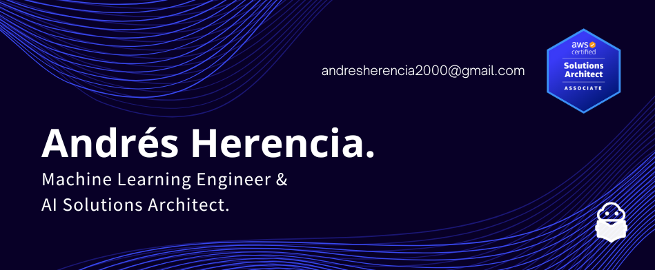

# Welcome to my profile!

## About Me

Hello there! I'm Andrés Herencia, a passionate professional with a background in Telecommunication Engineering and a Master's degree in Data Science. I thrive on learning and teaching new paradigms over technology. 

***Supporting others is the best way to support yourself.***

## Interests

| **Category**                         | **Skills**                                                    |
|--------------------------------------|--------------------------------------------------------------|
| **Data Science & Big Data**           | - Python (scikit-learn, statsmodels, etc.)                    |
|                                      | - R                                                          |
|                                      | - SQL & noSQL                                                |
|                                      | - MATLAB                                                     |
|                                      | - Spark                                                      |
|                                      | - Scala                                                      |
|--------------------------------------|--------------------------------------------------------------|
| **DevOps & Cloud Computing**          | - Python (scripting)                                         |
|                                      | - AWS (Amazon Web Services)                                  |
|                                      | - GCP (Google Cloud Platform)                                |
|                                      | - Bash & Powershell                                          |
|                                      | - Docker & Kubernetes                                       |
|                                      | - Ansible                                                    |
|--------------------------------------|--------------------------------------------------------------|
| **Full-stack development**            | - Java (SpringBoot)                                          |
|                                      | - JavaScript (React & React Native + node.js)               |
|                                      | - HTML                                                       |
|                                      | - CSS                                                        |
|                                      | - Python (Django & Streamlit)                                |
|--------------------------------------|--------------------------------------------------------------|

## Let's Collaborate!

If you share similar interests or have exciting projects that align with my skills, let's connect and collaborate! Feel free to explore my repositories and reach out for any questions, discussions, or potential collaborations. Together, we can bring innov
