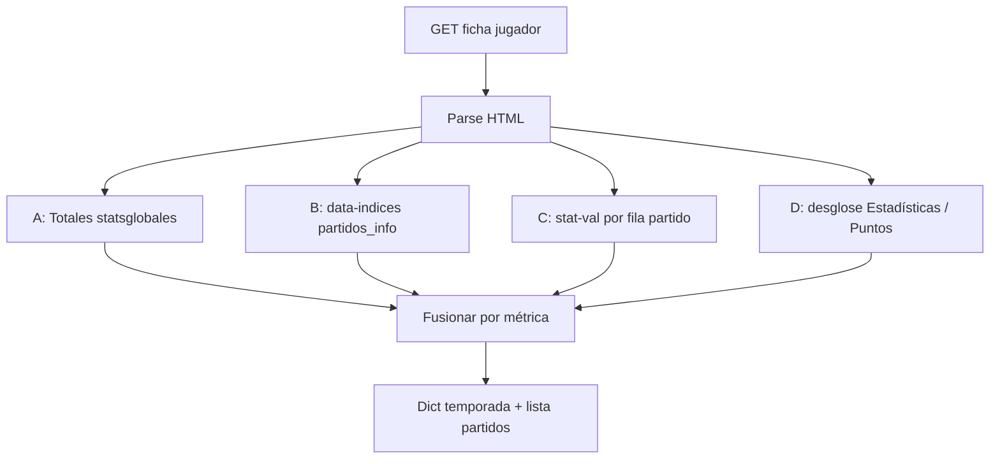

# Extracción HTML — estadísticas de jugador en FutbolFantasy

Guía para obtener, desde el HTML de la ficha de un jugador, las métricas habituales del reglamento LaLiga Fantasy / Puntos DAZN. No existe API pública documentada; el propio HTML del perfil incluye casi todo lo necesario.

| Meta | Valor |
| --- | --- |
| URL de ejemplo | [Raphinha — LaLiga 26/27](https://www.futbolfantasy.com/jugadores/raphinha/laliga-26-27) |
| Patrón URL | `https://www.futbolfantasy.com/jugadores/{slug}/laliga-{temporada}` |
| Ámbito de totales | Bloque «Estadísticas en LaLiga» (solo liga; no mezcla Champions/Copa en acumulados) |
| Documento relacionado | [Ficha Raphinha (referencia de valores)](futbolfantasy-raphinha-laliga-26-27.md) |
| Fecha de análisis | 2026-10-03 |

---

## Requisitos de la petición

- **GET** del HTML completo de la ficha (≈1 MB). Un `User-Agent` de navegador evita bloqueos intermitentes.
- No hace falta ejecutar JavaScript para la mayoría de métricas: vienen en el HTML inicial.
- El widget de **mercado** (`#mercadoBox`) sí carga por AJAX aparte; no afecta a las estadísticas listadas abajo.

---

## Mapa de la página (selectores útiles)

| Zona | Selector / ancla | Contenido |
| --- | --- | --- |
| Pestaña stats | `#profile-stats-puntos` | Estadísticas + puntos fantasy |
| Totales temporada | `#profile-stats-puntos .inside_tab.mod.statsglobales` | Big stats + tablas fila a fila |
| Big stats | `.bigstat` → `.label` + `.value` | Minutos, goles, asistencias, partidos… |
| Filas detalladas | `.table.stats.container .stat.info` | `.cell.label.info-left` + `.cell.value.info-right` |
| JSON por partido | `.poligono-wrapper[data-indices]` | `jugador_id`, `partidos_info`, medias |
| Tabla de partidos | `tr.plegado` / `tr.desglose` | Valores ocultos + desglose expandible |
| Stats por jornada (columna) | `span.stat-val.stat-{slug}` | Un número por partido (a menudo `display:none`) |
| Catálogo de slugs | `select.js-stat-type-select option[value]` | Nombre visible ↔ slug estable |
| Minutos por jornada | Script del gráfico `#minutosChart` | `const labels` + `const data` |
| ID interno | `data-indices` → `jugador_id` o URL imagen `/ficha/{id}.png` | p. ej. `4288` |

---

## Estrategias de extracción

### A — Totales de temporada (DOM por etiqueta)

Ámbito: acumulado LaLiga en la pestaña **Totales**.

1. Localizar `#profile-stats-puntos .statsglobales`.
2. Leer `.bigstat` emparejando `.label` (texto normalizado, sin `<br>`) con `.value`.
3. Para el resto, recorrer `.stat.info` y emparejar:
   - Etiqueta: texto de `.cell.label.info-left` sin los dos puntos finales (`:`).
   - Valor: texto de `.cell.value.info-right` (a veces `16 / 25 (64 %)` — hay que parsear el primer entero o el par según la métrica).

Ventaja: coincide con lo que ve el usuario en «Estadísticas en LaLiga».  
Inconveniente: algunas métricas **no** tienen fila en totales (p. ej. balones al área, recuperaciones).

### B — JSON embebido `data-indices` (por partido + medias)

1. Primer `.poligono-wrapper[data-indices]` (hay copias idénticas).
2. `json.loads(html.unescape(element["data-indices"]))`.
3. `partidos_info` es **otro JSON escapado** dentro del string → segundo `json.loads`.
4. Claves por `partido_id` con stats en **snake_case** (sumables para totales).

Campos presentes en el blob (ejemplo Raphinha, oct-2026):

`goles`, `asistencias`, `tiros`, `tiros_puerta`, `regates_exito`, `goles_encajados`, `despejes_efectivos`, `tarjetas_amarillas`, `tarjetas_rojas`, `posesiones_perdidas`, `paradas`, `penaltis_atajados`, `pases_clave`, `tackles`, …

**No** incluye (hay que usar A, C o D): minutos, ocasiones claras creadas, balones al área, penaltis cometidos/fallados, balones recuperados, goles en propia meta (como clave separada en partidos).

Las claves de nivel superior con decimales (`"goles": "1.71"`) son **medias por partido**, no totales.

### C — Tabla partido a partido (`stat-val`)

Cada fila de partido incluye spans:

```html
<span class="stat-val stat-goles" …>3</span>
<span class="stat-val stat-tiros-totales" …>4</span>
```

- Slug = `option[value]` del selector `.js-stat-type-select` (p. ej. `goles-encajados`, `penaltis-parados`).
- Clase CSS: `stat-val stat-{slug}` (stats combinadas usan slug compuesto en el `value`, no en la clase).
- Sumar por temporada o leer columna al cambiar stat en front (en scraping, leer todos los spans de cada fila).

Identificar partido: enlace en `tr.desglose` → `/partidos/{id}-…` o clave en `partidos_info`.

### D — Desglose expandible (regex / parseo de texto)

Dentro de `tr.desglose`:

| Bloque | Selector / patrón | Formato |
| --- | --- | --- |
| Puntos LaLiga Fantasy | `.desg.laliga-fantasy .estadistica` | `{n}  {Evento}  →  {m} p` |
| Estadísticas crudas | hermano con `<strong>Estadísticas</strong>` | `{Evento}  ({n})` |
| Minutos | mismo bloque Puntos | `{n}  Minutos jugados` |

Regex útil (multilínea):

- Estadísticas: `^\s*([^(\n]+)\s+\((\d+)\)`
- Puntos (conteo): `^\s*(\d+)\s+(.+?)\s+<i class="fa fa-arrow-right`
- Balones al área (solo aquí en muchos perfiles): línea con texto `Balones al área`

**Nota:** En puntuación LaLiga aparece «Goles en contra»; en el bloque Estadísticas suele decir «Goles encajados» — mismo concepto fantasy, distinto rótulo.

---

## Tabla de métricas solicitadas

Leyenda **Ámbito**: `T` = total temporada, `P` = por partido, `T*` = total calculado sumando partidos.

| Métrica (tu lista) | Nombre en FutbolFantasy | Ámbito | Cómo obtenerlo |
| --- | --- | --- | --- |
| Minutos jugados | Minutos jugados | T | `.bigstat` label «Minutos jugados» → `.value` (550) |
| Minutos jugados | Minutos jugados | P | Regex en `.desg.laliga-fantasy`; o `const data` del script `#minutosChart` + `labels` (jornada) |
| Goles | Goles | T | `.bigstat` o fila «Goles / Tiros:» (primer número) |
| Goles | Goles | P | `stat-goles`; JSON `goles` |
| Asistencias | Asistencias | T | `.bigstat` o fila «Asistencias:» |
| Asistencias | Asistencias | P | `stat-asistencias`; JSON `asistencias` |
| Grandes ocasiones creadas | Ocasiones claras creadas | T | Fila «Ocasiones claras creadas:» |
| Grandes ocasiones creadas | Ocasiones claras creadas | P | `stat-ocasiones-claras-creadas`; bloque Estadísticas; sumar P → T* |
| Balones al área | Balones al área | P | Línea en `.desg.laliga-fantasy` (puntos); **no** hay fila en totales T |
| Balones al área | Balones al área | P | `stat-pases-area-exito` (slug `pases-area-exito`; la etiqueta del `<option>` está mal como «Pases clave») |
| Penaltis cometidos | Penaltis cometidos | T | Fila «Penaltis cometidos:» |
| Penaltis cometidos | Penaltis cometidos | P | `stat-penaltis-cometidos` |
| Penaltis salvados | Penaltis parados | T | Solo porteros; fila en totales si aplica |
| Penaltis salvados | Penaltis parados | P | `stat-penaltis-parados`; JSON `penaltis_atajados` |
| Salvadas | Paradas | T | Porteros; fila «Paradas» en totales si existe |
| Salvadas | Paradas | P | `stat-paradas`; JSON `paradas` |
| Despejes claros | Despejes efectivos | T | Fila «Despejes efectivos:» |
| Despejes claros | Despejes efectivos | P | `stat-despejes`; JSON `despejes_efectivos` |
| Penaltis fallados | Penaltis fallados | T | Fila «Penaltis fallados:» |
| Penaltis fallados | Penaltis fallados | P | `stat-penaltis-fallados` |
| Goles en propia | Goles en propia meta | T | Fila «Goles en propia meta:» |
| Goles en propia | Goles en propia meta | P | `stat-goles-propia-meta` |
| Goles en contra | Goles encajados / Goles en contra | T* | JSON: sumar `goles_encajados`; en T no hay fila única para campo |
| Goles en contra | Goles encajados | P | `stat-goles-encajados`; bloque Estadísticas «Goles encajados (n)» |
| Tarjetas amarillas | Tarjetas amarillas | T | Fila «Tarjetas amarillas:» |
| Tarjetas amarillas | Tarjetas amarillas | P | `stat-tarjetas-amarillas`; JSON `tarjetas_amarillas` |
| Tarjeta roja | Tarjeta roja | T | Fila «Tarjeta roja:» |
| Tarjeta roja | Tarjeta roja | P | `stat-tarjeta-roja`; JSON `tarjetas_rojas` |
| Intentos de gol | Tiros | T | Fila «Tiros a puerta / Tiros:» → **segundo** número (25) |
| Intentos de gol | Tiros | P | `stat-tiros-totales`; JSON `tiros` |
| Regates efectivos | Regates con éxito | T | Fila «Regates con éxito:» |
| Regates efectivos | Regates con éxito | P | `stat-regates-exito`; JSON `regates_exito` |
| Recuperaciones | Balones recuperados | P | `stat-balones-recuperados`; bloque Estadísticas si aparece |
| Recuperaciones | Balones recuperados | T* | **No** equivale a «Balones robados» del total T — sumar partidos |
| Balones perdidos | Posesiones perdidas | T | Fila «Posesiones perdidas:» |
| Balones perdidos | Posesiones perdidas | P | `stat-posesiones-perdidas`; JSON `posesiones_perdidas` |

---

## Slugs del selector ↔ clase `stat-val`

Referencia rápida (opción `value` → clase):

| `option value` | Clase `stat-val` |
| --- | --- |
| `goles` | `stat-goles` |
| `asistencias` | `stat-asistencias` |
| `ocasiones-claras-creadas` | `stat-ocasiones-claras-creadas` |
| `pases-area-exito` | `stat-pases-area-exito` |
| `tiros-totales` | `stat-tiros-totales` |
| `regates-exito` | `stat-regates-exito` |
| `posesiones-perdidas` | `stat-posesiones-perdidas` |
| `penaltis-cometidos` | `stat-penaltis-cometidos` |
| `penaltis-fallados` | `stat-penaltis-fallados` |
| `penaltis-parados` | `stat-penaltis-parados` |
| `paradas` | `stat-paradas` |
| `despejes` | `stat-despejes` |
| `goles-propia-meta` | `stat-goles-propia-meta` |
| `goles-encajados` | `stat-goles-encajados` |
| `tarjetas-amarillas` | `stat-tarjetas-amarillas` |
| `tarjeta-roja` | `stat-tarjeta-roja` |
| `balones-recuperados` | `stat-balones-recuperados` |
| `balones-robados` | `stat-balones-robados` |

Stats con barra en el `value` (p. ej. `tiros-puerta|tiros-totales`) exponen clases separadas (`stat-tiros-puerta`, `stat-tiros-totales`).

---

## Flujo recomendado (scraper)



Prioridad sugerida:

1. **T** desde A (etiquetas en español).
2. **P** desde C (numérico, estable).
3. Completar huecos con B (sumas) o D (texto).
4. Validar T* sumando P cuando no exista fila en totales.

---

## Ejemplo mínimo en Python

Dependencias: `requests`, `beautifulsoup4` (o `lxml` + `html.unescape`).

```python
import json
import re
from html import unescape
from urllib.parse import urlparse

import requests
from bs4 import BeautifulSoup

URL = "https://www.futbolfantasy.com/jugadores/raphinha/laliga-26-27"
HEADERS = {"User-Agent": "Mozilla/5.0 (compatible; stats-research/1.0)"}


def fetch_soup(url: str) -> BeautifulSoup:
    response = requests.get(url, headers=HEADERS, timeout=60)
    response.raise_for_status()
    return BeautifulSoup(response.text, "html.parser")


def parse_label_totals(soup: BeautifulSoup) -> dict[str, str]:
    root = soup.select_one("#profile-stats-puntos .statsglobales")
    if not root:
        return {}
    out: dict[str, str] = {}
    for block in root.select(".bigstat"):
        label = block.select_one(".label")
        value = block.select_one(".value")
        if label and value:
            key = " ".join(label.get_text(strip=True).split())
            out[key] = value.get_text(strip=True)
    for row in root.select(".stat.info"):
        lab = row.select_one(".cell.label.info-left")
        val = row.select_one(".cell.value.info-right")
        if lab and val:
            key = lab.get_text(strip=True).rstrip(":")
            out[key] = val.get_text(strip=True)
    return out


def parse_data_indices(soup: BeautifulSoup) -> dict:
    node = soup.select_one(".poligono-wrapper[data-indices]")
    if not node:
        return {}
    payload = json.loads(unescape(node["data-indices"]))
    payload["partidos_info"] = json.loads(payload["partidos_info"])
    return payload


def parse_match_stats(soup: BeautifulSoup) -> list[dict[str, int]]:
    rows: list[dict[str, int]] = []
    for tr in soup.select("tr.plegado"):
        stats: dict[str, int] = {}
        for span in tr.select("span.stat-val"):
            classes = span.get("class", [])
            for cls in classes:
                if cls.startswith("stat-") and cls != "stat-val":
                    slug = cls.replace("stat-", "", 1)
                    stats[slug] = int(span.get_text(strip=True) or 0)
        if stats:
            rows.append(stats)
    return rows


def sum_partidos_info(partidos: dict) -> dict[str, float]:
    totals: dict[str, float] = {}
    for match in partidos.values():
        for key, val in match.items():
            if isinstance(val, (int, float)) and val is not None:
                totals[key] = totals.get(key, 0) + val
    return totals


if __name__ == "__main__":
    soup = fetch_soup(URL)
    labels = parse_label_totals(soup)
    indices = parse_data_indices(soup)
    per_match = parse_match_stats(soup)
    print("Minutos (total):", labels.get("Minutos jugados"))
    print("Goles (total):", labels.get("Goles"))
    print("Tiros (total):", labels.get("Tiros a puerta / Tiros"))
    print("Suma tiros JSON:", sum_partidos_info(indices.get("partidos_info", {})).get("tiros"))
    print("Partidos parseados:", len(per_match))
```

---

## Limitaciones y trampas

| Tema | Detalle |
| --- | --- |
| Recuperaciones vs robos | Totales muestran «Balones robados»; LaLiga Fantasy puntúa «Balones recuperados» en partido — métricas distintas |
| Balones al área | Sin acumulado T en DOM; sumar partidos o usar desglose |
| OCC | No está en `partidos_info`; usar `stat-ocasiones-claras-creadas` o fila T |
| Minutos | No están en `partidos_info`; gráfico JS o regex en desglose |
| Medias vs totales | `data-indices` mezcla medias (strings decimales) y `partidos_info` (enteros) |
| HTML oculto | `.statsglobales` puede llevar `d-none`; el contenido sigue en el HTML servido |
| Cambios de plantilla | Slugs y clases han sido estables en 2026; conviene tests de regresión |
| Legal / ToS | Scraping responsable; respetar robots.txt y carga del sitio |

---

## Referencia cruzada DAZN ↔ extracción

| Concepto DAZN | Etiqueta / slug principal |
| --- | --- |
| Minutos jugados | «Minutos jugados» / script minutosChart |
| Goles | `goles` |
| Asistencias | `asistencias` |
| Grandes ocasiones creadas | «Ocasiones claras creadas» / `ocasiones-claras-creadas` |
| Balones al área | Texto desglose / `pases-area-exito` |
| Penaltis cometidos | `penaltis-cometidos` |
| Penaltis salvados | `penaltis-parados` (`penaltis_atajados`) |
| Salvadas | `paradas` |
| Despejes claros | `despejes` / `despejes_efectivos` |
| Penaltis fallados | `penaltis-fallados` |
| Goles en propia | `goles-propia-meta` |
| Goles en contra | `goles-encajados` |
| Tarjetas | `tarjetas-amarillas`, `tarjeta-roja` |
| Intentos de gol | `tiros-totales` / `tiros` |
| Regates efectivos | `regates-exito` |
| Recuperaciones | `balones-recuperados` |
| Balones perdidos | `posesiones-perdidas` |
