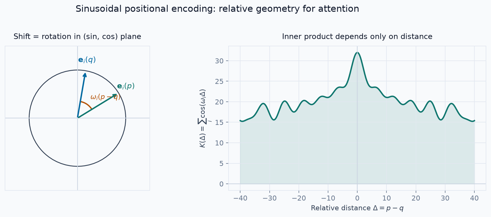

# LinkedIn Post — Sinusoidal Positional Encoding

Copy the **Post** section into LinkedIn. Attach `sinusoidal-pe-foundation.png` as the image.
Use the **Math foundation block** if you want a second carousel slide / first comment.

---

## Post

The Transformer architecture marked a before and after.

Almost all modern AI — including agentic systems that automate workflows and generate code at scale — rests on this design. It starts with the paper that defined the modern era of machine learning: *Attention Is All You Need*.

Modeling language needs two things at once:
1. preserve order
2. model relationships between words, regardless of where they appear

Before Transformers, no single architecture did both well:
- Feedforward networks capture semantics between tokens effectively
- RNNs and CNNs handle sequential order much better

The question became: how do you combine sequential structure with rich semantic modeling?

The Transformer’s answer was **positional encoding**.

Positional encoding stores each token *together with its position* as it enters the network. That preserves order *and* enables parallel training — a key reason we can train models with billions of parameters efficiently.

But absolute indices alone are not enough.

Language depends on **relative** position:
- nearby words usually matter more
- distant words usually matter less
- swapping word order can change meaning entirely (“not” moved one place can invert a sentence)

So the model needs a representation where relative distance is easy to recover.

Why not a simple linear, quadratic, or log map of position?

Those functions are often unbounded or make relative distances awkward to compute without knowing the full sequence length. Sinusoids solve this more cleanly.

Sinusoidal positional encodings have four decisive properties:
- continuous and smooth
- closed under translation via rotation
- multi-frequency (local + long-range scales)
- defined for any sequence length without new parameters

That is the surprising part: among functions tried for this role, sinusoids remain uniquely effective at encoding both absolute position and relative geometry in a form attention can use.

Later methods such as RoPE still build on the same idea — representing position as phase, and relative distance as phase difference. Sometimes, one well-chosen modulated signal is enough for models to adapt across inputs and datasets.

Would you rather see a deeper dive into **RoPE**, or into the failed alternatives that tried to move beyond sinusoids?

---

## Math foundation block (attach / carousel / first comment)

```markdown
### Why sinusoids work (1-minute math)

Sinusoidal PE maps a scalar position \(p\) into many frequency pairs:

\[
PE(p,2i)=\sin(\omega_i p),\quad
PE(p,2i+1)=\cos(\omega_i p),\quad
\omega_i=10000^{-2i/d}
\]

**Key fact:** a shift becomes a linear rotation that depends only on the offset \(k\):

\[
\mathbf{e}_i(p+k)=R_i(k)\,\mathbf{e}_i(p)
\]

**Consequence for attention:** the inner product depends on relative distance, not absolute indices:

\[
PE(p)^\top PE(q)=\sum_i\cos\!\bigl(\omega_i(p-q)\bigr)
\]

| Property | What it buys the model |
|---|---|
| Shift ↔ rotation | Relative offsets are linearly accessible |
| Distance ↔ phase gap | Attention scores carry separation info |
| Many frequencies | Local resolution + long-range context |
| Fourier basis | Position patterns learnable via linear layers |



**Takeaway:** sinusoids turn discrete translation into algebra that fits Transformers — rotations in 2D planes + inner products that read relative distance.
```

---

## Image to attach

- Preferred chart: `sinusoidal-pe-foundation.png`
- Alternative illustration: `sinusoidal-pe-relative-distance.png`
