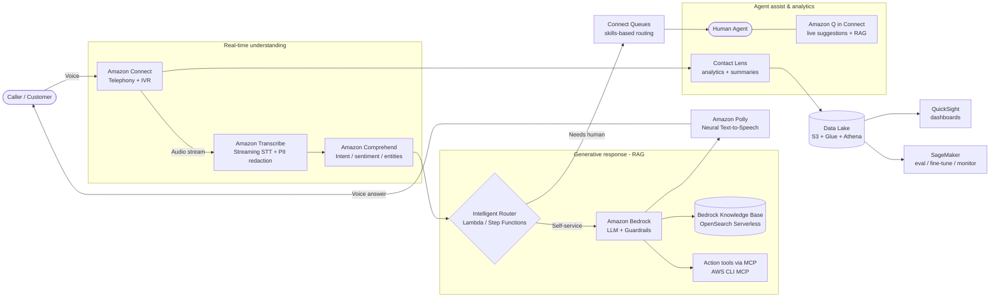
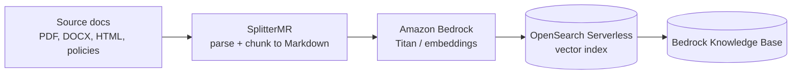

# Generative AI for Call Center Modernization in Banking — AWS Solution Proposal

> **Author:** Andrés Herencia · **Domain:** Retail & Corporate Banking / Financial Services
> **Scope:** AI & Data Science + Cloud Engineering on AWS
> **Status:** Proposal / reference architecture

---

## 1. Executive summary

Contact centers are the most expensive and most regulated customer touchpoint in a
bank. The proposal turns the original idea — **Speech-to-Text + automatic responding +
intelligent routing** — into an end-to-end, production-grade **Generative AI contact
center** built natively on AWS.

The core narrative is a single conversation that flows through four stages:

1. **Listen** — transcribe the caller in real time (Speech-to-Text).
2. **Understand** — detect intent, sentiment, entities, and PII.
3. **Act** — answer with a grounded Generative AI assistant (RAG over the bank's
   knowledge), and/or **route** the call to the right queue or human agent.
4. **Assist & learn** — give human agents live suggestions and feed every interaction
   back into analytics and model improvement.

Two of my existing open-source projects plug directly into this core:

- **[SplitterMR](https://github.com/andreshere00/Splitter_MR)** — ingests and chunks the
  bank's documents (policies, product sheets, FAQs, regulatory texts) into
  LLM-friendly Markdown for the RAG knowledge base.
- **[AWS CLI MCP](https://github.com/andreshere00/aws_cli_mcp)** — provides an
  MCP/agentic tool layer so the assistant can safely execute scoped backend actions
  (balance lookup, card blocking, ticket creation) through governed tools.

---

## 2. Business goals & KPIs

| Objective | KPI | Why it matters in banking |
|---|---|---|
| Reduce cost per contact | Containment rate (% resolved without an agent) | Self-service for routine, high-volume requests |
| Faster resolution | Average Handle Time (AHT), First Contact Resolution | Lower queue times, fewer transfers |
| Better routing | Misroute / transfer rate | Right skill on first attempt |
| Agent productivity | After-Call-Work time, agent ramp-up time | Live assist + auto-summaries |
| Customer experience | CSAT / NPS, sentiment trend | Retention, regulatory reputation |
| Compliance | % PII-redacted recordings, audit coverage | PCI-DSS, GDPR, MiFID II, AML |

---

## 3. End-to-end architecture

### 3.1 High-level flow

### 3.2 Knowledge ingestion pipeline (offline)

---

## 4. AWS service mapping (the "core", expanded)

| Capability | Primary AWS service | Notes / alternatives |
|---|---|---|
| Cloud contact center / telephony / IVR | **Amazon Connect** | Native CCaaS; contact flows, queues, Customer Profiles |
| Speech-to-Text (real time) | **Amazon Transcribe** (streaming, Call Analytics) | Custom vocabulary for banking terms; real-time PII redaction. Alt: Whisper on SageMaker for niche languages |
| Intent / sentiment / entities | **Amazon Comprehend** + **Bedrock** | Comprehend for fast NLU + PII; LLM for nuanced intent |
| Conversational bot / IVR NLU | **Amazon Lex** | Slot filling for structured tasks (auth, transfers) |
| Generative responses (RAG) | **Amazon Bedrock** (Claude / Titan / Llama) | Managed LLMs, **Bedrock Guardrails**, **Knowledge Bases** |
| Vector store / retrieval | **OpenSearch Serverless** or **Amazon Kendra** | Kendra for enterprise search relevance out of the box |
| Action execution (agentic) | **Lambda** + **AWS CLI MCP** tools | Governed, least-privilege backend actions |
| Text-to-Speech | **Amazon Polly** (neural / generative voices) | Multilingual, SSML |
| Agent assist | **Amazon Q in Connect** | Live answers + recommended actions to agents |
| Post-call analytics | **Contact Lens** | Sentiment, categories, auto-summaries, compliance checks |
| Orchestration | **AWS Step Functions** + **Lambda** | Stateful conversation/action orchestration |
| Customer 360 | **Connect Customer Profiles** + **DynamoDB** | Unified profile to personalize and route |
| Data lake & analytics | **S3 + Glue + Athena + QuickSight** | Reporting, BI, KPI dashboards |
| MLOps | **Amazon SageMaker** | Eval, fine-tuning, drift/quality monitoring |
| Security & governance | **KMS, IAM, VPC, PrivateLink, CloudTrail, Macie** | Encryption, isolation, audit, PII discovery |

---

## 5. Why this design (rationale)

- **Buy the undifferentiated, build the differentiators.** Amazon Connect, Transcribe,
  Polly, and Bedrock cover telephony, STT/TTS, and LLM hosting as managed services, so
  engineering effort concentrates on the bank-specific layer: knowledge grounding,
  routing logic, guardrails, and integrations.
- **RAG over fine-tuning first.** In banking, answers must be **grounded and current**
  (rates, fees, T&Cs change). A Bedrock Knowledge Base fed by SplitterMR keeps answers
  traceable to a source document, which is essential for auditability and reduces
  hallucination risk. Fine-tuning is reserved for tone/format and intent classification.
- **Agentic actions through governed tools.** Free-text LLM access to core banking is
  unacceptable. The **AWS CLI MCP** pattern exposes a *closed catalog* of typed,
  least-privilege tools (e.g. `get_balance`, `block_card`, `open_ticket`), each behind
  IAM and audit logging — the LLM can only call what it is explicitly granted.
- **Human-in-the-loop by default.** High-risk intents (disputes, fraud, loan decisions,
  vulnerable customers) are always routed to a human; GenAI assists rather than decides.

---

## 6. Security, compliance & responsible AI (banking-grade)

This is the make-or-break layer for the financial sector:

- **Data protection:** encryption at rest (KMS/CMK) and in transit (TLS); private
  networking via VPC endpoints / **PrivateLink** so traffic to Bedrock/Transcribe never
  leaves the AWS network; **Amazon Macie** to discover sensitive data in S3.
- **PII handling:** real-time **PII redaction** in Transcribe and Comprehend; redact
  before storage and before sending context to the LLM; tokenization of PANs (PCI-DSS).
- **Guardrails:** **Bedrock Guardrails** for denied topics (e.g. no unsolicited financial
  advice), profanity/PII filters, and grounding checks to block hallucinated facts.
- **Auditability:** **CloudTrail** for every API/tool call, full conversation transcripts
  with source citations, immutable logging for regulators (MiFID II, GDPR, AML).
- **Access control:** least-privilege **IAM** per tool/role; segregation of duties;
  no standing credentials (use roles + temporary tokens).
- **Data residency:** deploy in the required region (e.g. EU) and use region-pinned
  Bedrock models to satisfy residency requirements.
- **Model governance:** evaluation harness for accuracy/toxicity/bias before promotion;
  versioned prompts and knowledge bases; human review of high-risk flows.

---

## 7. Reuse of existing projects

| Project | Role in this solution |
|---|---|
| **SplitterMR** | Document ingestion: parse heterogeneous banking docs (PDF, DOCX, HTML, scans) and chunk them into clean Markdown with the right strategy + embeddings, feeding the Bedrock Knowledge Base for accurate RAG. |
| **AWS CLI MCP** | Agentic action layer: an MCP server exposing governed, least-privilege tools so the assistant can perform real operations and infra/ops tasks through a controlled interface. |

---

## 8. Delivery phases (technical scope, not calendar)

1. **Foundations** — landing zone, VPC, IAM, KMS, logging; Amazon Connect instance;
   data lake skeleton.
2. **Listen & understand** — Transcribe streaming + PII redaction; Comprehend intent and
   sentiment; baseline routing in Connect contact flows.
3. **Generative self-service** — Bedrock + Knowledge Base (ingested via SplitterMR);
   Guardrails; Lex for structured tasks; Polly responses.
4. **Agentic actions** — MCP tool catalog (AWS CLI MCP) behind Lambda + Step Functions;
   least-privilege integrations to core banking APIs (sandbox first).
5. **Agent assist & analytics** — Amazon Q in Connect, Contact Lens, QuickSight KPI
   dashboards.
6. **MLOps & hardening** — SageMaker evaluation/monitoring, drift detection, prompt and
   KB versioning, load/security testing, DR.

---

## 9. Risks & mitigations

| Risk | Mitigation |
|---|---|
| Hallucinated financial facts | RAG grounding + Bedrock Guardrails grounding checks + citations; human-in-the-loop for high-risk |
| PII leakage to LLM | Redact in Transcribe/Comprehend before prompting; PrivateLink; no PII in logs |
| Over-broad model permissions | Closed MCP tool catalog, per-tool IAM, audit trail |
| STT accuracy (accents, banking jargon) | Custom vocabulary/language models; fallback to human |
| Regulatory non-compliance | Immutable audit logs, data residency, governance reviews |
| Vendor lock-in | Abstraction layer for STT/LLM; portable RAG and MCP components |

---

## 10. Summary

The proposed solution keeps the original **Speech-to-Text → automatic response →
routing** core intact, but elevates it into a complete, compliant, banking-grade
Generative AI contact center on AWS: **Amazon Connect** for telephony, **Transcribe**
for STT, **Comprehend** for understanding, **Bedrock + Knowledge Bases** for grounded
generative answers, **Polly** for voice, intelligent **routing** with human-in-the-loop,
**Amazon Q in Connect** for agent assist, and a robust security, governance, and MLOps
foundation. Two existing projects — **SplitterMR** (knowledge ingestion) and
**AWS CLI MCP** (agentic actions) — slot directly into the architecture.
